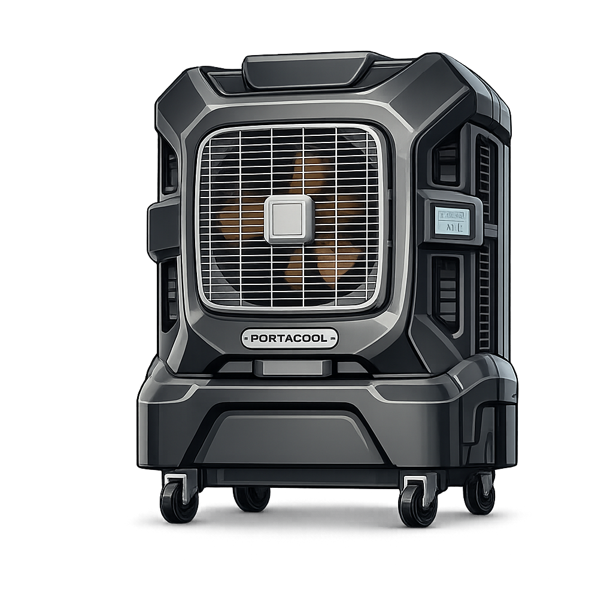

# Portacool APEX

A Home Assistant custom integration for controlling **Portacool APEX evaporative coolers** using Portacool’s cloud backend (REST + Firebase Realtime Database).

This integration is **UI-configured only** (no YAML).

> Unofficial integration — not affiliated with or endorsed by Portacool.

---

## What’s working today

### Controls
- **Power** (switch)
- **Fan Mode** (select) — Off / 10% / 20% / 40% / 70% / 100%
- **Pump Mode** (select) — Off / Eco / Manual 1–5 / Max  
  - **Safety:** Pump control is disabled when the **Water Tank Empty** alert is active.

### State & telemetry (sensors)
- **Timer Remaining** (sensor) — countdown derived from `TimerExpiry`
- **Temperatures** (sensors)
  - Ambient Temperature (DP3)
  - Exit Temperature (DP4)
  - Media Temperature (DP23)
  - Water Temperature (DP24)
- **Calculated Airflow (CFM)** (sensor) — DP7 (empirically correlated)
- **Max Airflow %** (sensor) — DP7 scaled vs `FAN_CFM_MAX`
- **Input Voltage** (sensor) — DP31/DP32 (best available)
- **Alert category sensors** (sensors)
  - Overall Status
  - Fan / Pump / Water / Temperature / Voltage status
  - **Louvers status is hidden on non-louver models** (see “Model support”)

### Water
- **Water Alert** (sensor) — Empty / Low / Overfill (from alerts)
- **Water Level** (sensor) — derived from DP5 (1–5 bars → % scale)

---

## Model support

The integration should work across the APEX line for the features above.

**Louvers**
- APEX 500 / 700: hardware includes louvers; louver control datapoints are not implemented yet.
- APEX 1200 / 2000 / 4000: no louvers; louver-related status is hidden.

If you own a louver-capable model and can provide captures (datapoints + invoke-action payloads), louver control support can be added.

---

## Installation (HACS)

1. Open **HACS → Integrations**
2. **⋮ → Custom repositories**
3. Add repository:
   - `https://github.com/JCSharpIII/ha-portacool-apex`
   - Category: **Integration**
4. Install **Portacool APEX**
5. Restart Home Assistant

---

## Setup

1. **Settings → Devices & Services → Add Integration**
2. Search for **Portacool APEX**
3. Sign in with your Portacool credentials
4. The integration discovers your devices and names the entry from the API (e.g., `APEX 1200 (PACA12001A1A)`)

---

## How it works

- **Commands**: `POST https://api.services.portacool.com/device-api/devices/invoke-action`
- **Device discovery**: `GET /device-api/devices/my`
- **Alerts**: `POST /device-api/devices/alerts/latest`
- **Realtime state**: Firebase RTDB (app-authenticated)
  - The integration retrieves a Portacool “firebase custom token”, exchanges it for a Firebase `idToken`, and reads RTDB nodes for:
    - `/users/<uid>/<uniqueId>/datapoints`
    - `/users/<uid>/<uniqueId>/timer`

---

## Configuration (Options)

Open **Settings → Devices & Services → Portacool APEX → Configure**.

Typical options:
- **Firebase Web API Key** (public)  
  Only change if Portacool rotates the key and auth starts failing.
- **Polling interval**  
  How often HA refreshes from cloud.
- **Offline refresh**  
  Limits cloud refresh when device power is off to reduce traffic.

---

## Dashboard examples

### Entities + history + gauge

```yaml
type: vertical-stack
cards:
  - type: entities
    title: Portacool APEX
    show_header_toggle: false
    entities:
      - entity: switch.apex_1200_power
        name: Power
      - entity: select.apex_1200_fan_mode
        name: Fan Mode
      - entity: select.apex_1200_pump_mode
        name: Pump Mode
      - entity: select.apex_1200_sleep_timer
        name: Timer
      - entity: sensor.apex_1200_timer_remaining
        name: Timer Remaining (s)
      - entity: sensor.apex_1200_water_alert
        name: Water Alert
      - entity: sensor.apex_1200_water_level
        name: Water Level
    state_color: true

  - type: history-graph
    title: Trends (last 2h)
    hours_to_show: 2
    refresh_interval: 30
    entities:
      - entity: sensor.apex_1200_exit_temperature
        name: Exit
      - entity: sensor.apex_1200_ambient_temperature
        name: Ambient
      - entity: sensor.apex_1200_calculated_airflow_cfm
        name: Airflow (CFM)

  - type: gauge
    name: Water Level (Estimated)
    entity: sensor.apex_1200_water_level
    min: 0
    max: 110
    needle: false
```

Notes:
- If you see the device name being prefixed on only one entity in a card, that’s usually the card’s “secondary info” / name resolution behavior; set explicit `name:` for each entity to keep it consistent.

---

## Debug logging

```yaml
logger:
  default: info
  logs:
    custom_components.portacool_apex: debug
```

---


Dashboard Card Suggestions:


Vertical Stack Card
-----------------------

type: vertical-stack
cards:
  - type: entities
    title: Portacool Apex 1200
    show_header_toggle: false
    entities:
      - entity: switch.apex_1200_power
        name: Power
      - entity: select.apex_1200_fan_mode
        name: Fan Mode
      - entity: select.apex_1200_pump_mode
        name: Pump Mode
      - entity: select.apex_1200_sleep_timer
        name: Timer
      - entity: sensor.apex_1200_timer_remaining
        name: Timer Remaining (s)
      - entity: sensor.apex_1200_water_alert
        name: Alert
    state_color: true
  - type: history-graph
    title: Trends (last 2h)
    hours_to_show: 2
    refresh_interval: 30
    entities:
      - entity: sensor.apex_1200_exit_temperature
        name: Exit
      - entity: sensor.apex_1200_ambient_temperature
        name: Ambient
      - entity: sensor.apex_1200_fan_feedback
        name: Airflow (CFM)
  - type: gauge
    name: Water Level (Estimated)
    entity: sensor.apex_1200_water_level
    min: 0
    max: 110
    needle: false

---

## Known limitations

- Cloud-only (no local LAN control)
- Louvers controls not implemented
- Some datapoints remain unknown and are documented as “inferred”

---

## License

MIT


