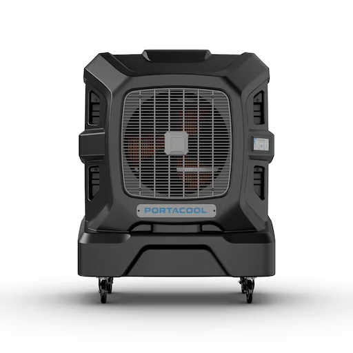

# PortaCool Apex

A Home Assistant custom integration for controlling **PortaCool Apex evaporative coolers** using the official PortaCool cloud API.

This integration is **UI-configured only** (no YAML) and provides direct control of power, fan speed, and timer functions.

---

## Features

- Cloud-based authentication using PortaCool credentials
- Main power control (On / Off)
- Fan speed selection via dropdown (0–5)
- Timer control via dropdown
- Native Home Assistant entities
- Config Flow setup (no YAML)

---

## Entities Created

For each PortaCool Apex device, the following entities are created:

### Switch

- **Power**  
  Turns the unit on or off.

### Select

- **Fan Speed**  
  Discrete fan speed selection:
  - 0 (Off)
  - 1
  - 2
  - 3
  - 4
  - 5

- **Timer**
  - Off
  - 30 minutes
  - 1 hour
  - 2 hours
  - 4 hours
  - 8 hours

Fan speed is implemented as a `select` entity instead of a fan on/off switch to match how the PortaCool API behaves.

---

## Installation (HACS)

1. Open **HACS**
2. Go to **Integrations**
3. Add this repository as a **Custom Repository**
4. Select **Integration**
5. Install **PortaCool Apex**
6. Restart Home Assistant

---

## Setup

1. Go to **Settings → Devices & Services**
2. Click **Add Integration**
3. Search for **PortaCool Apex**
4. Log in using your PortaCool account credentials
5. Select the device you want to add

---

## Configuration Notes

- YAML configuration is **not supported**
- Fan on/off services are **not exposed**
- Fan speed `0` effectively acts as “fan off”
- Cloud latency depends on PortaCool API responsiveness

---

## Requirements

- Home Assistant **2024.6.0** or newer
- Active PortaCool account
- Internet connectivity (cloud-based API)

---

## Known Limitations

- Pump and water level controls are not yet exposed
- No local control (cloud API only)
- API does not provide real-time state updates for all datapoints

---

## Disclaimer

This is an **unofficial** integration and is not affiliated with or endorsed by PortaCool.

---

## Support

If you encounter issues:

- Enable debug logging for `portacool_apex`
- Open a GitHub issue with logs and device model information

---

## License

MIT License
